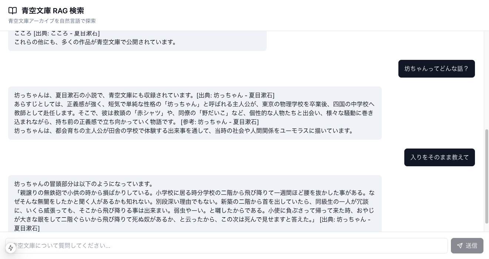

# 青空文庫 RAG 検索システム

青空文庫の膨大なアーカイブを、自然言語で直感的に検索できるRAG（Retrieval-Augmented Generation）システムです。
単なるキーワード検索ではなく、文脈を理解した検索と、信頼できる出典の明示により、深い文学探索体験を提供します。



## ✨ 主な機能

### 1. 文脈理解による自然言語検索
「夏目漱石の作品で、猫が登場するシーンは？」「友情について書かれた短編を探して」といった曖昧な質問に対し、AIが意図を理解してアーカイブを横断検索します。

### 2. 明確な出典と根拠の提示
生成AIの回答には必ず **[出典: 作品名]** が付与されます。
リンクをクリックすると、サイドパネルに**実際のテキスト（原文）**が表示され、該当箇所がハイライトされます。「AIの作り話」ではなく「実際の記述」を確認できます。

### 3. Web情報のハイブリッド活用
青空文庫にない情報（作者の背景、現代的な解釈など）が必要な場合は、自動的にWeb検索を行い、**[Web参考]** として補足情報を提示します。
あくまで「原作」を主役とし、Web情報は脇役として扱う設計です。

---

## 🛠 技術スタック

| レイヤー | 技術 | 用途 |
| --- | --- | --- |
| **Frontend** | **Next.js** + **Vercel AI SDK** | モダンなチャットUI、ストリーミング応答 |
| **Backend** | **FastAPI** (Python) | 検索ロジックのオーケストレーション |
| **Vector DB** | **ChromaDB** | ローカルでの高速なベクトル検索 |
| **Search** | **Exa API** | LLM向けの高精度Web検索 |
| **LLM** | **Gemini 3.0 Flash** | 高速かつロングコンテキスト対応 |
| **Embedding** | **OpenAI text-embedding-3** | 日本語に強い埋め込みモデル |

---

## 🚀 はじめ方

詳細なセットアップ手順は [docs/setup.md](docs/setup.md) を参照してください。

### クイックスタート (Nixユーザー向け)

```bash
# 1. 環境構築
nix-shell

# 2. 依存インストール & データ準備
# (docs/setup.md の手順に従って .env を設定後)
cd scripts && ./fetch_aozora_repo.sh && python ingest_pipeline.py

# 3. 起動
# Terminal 1
cd backend && uvicorn app.main:app --reload
# Terminal 2
cd frontend && npm run dev
```

---

## 📂 ディレクトリ構成

```
aozora-rag-chat/
├── frontend/          # Next.js アプリケーション
├── backend/           # FastAPI サーバー
├── scripts/           # データ取得・加工・登録パイプライン
├── data/              # 青空文庫データ（Git submodule等）
├── chroma/            # ベクトルDBの実体
└── docs/              # ドキュメント
```
